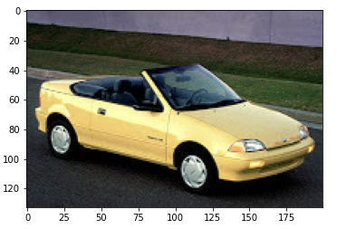
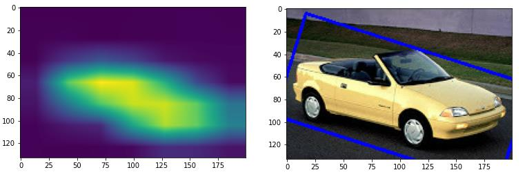
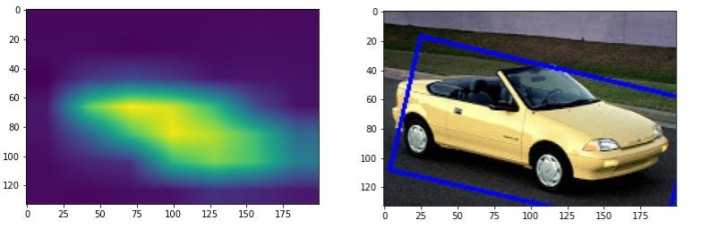

##  CAM(Class ACtivation Map)
- **backbone : [ResNet50](https://keras.io/api/applications/resnet/#resnet50-function)**

using tfds 'cars196' datasets.   

CAM and Grad-CAM visualization and Iou evaluation.   

CAM과 Grad-CAM을 시각화 하고 bbox를 얻은 후 정답 bbox와 IoU를 구해서 CAM과 Grad-CAM을 비교해 보겠습니다.   

---

## Original image

위의 원본 이미지를 CAM 과 Grad-CAM으로 시각화 하고 boundgin box를 구한 결과는 아래와 같습니다.     

---

### CAM

- original image에 ResNet50을 backbone으로 한 CAM modle 시각화 및 bbox

---

### Grad-CAM

- Activation layer = 'conv5_block3_out'
- original image에 ResNet50을 backbone으로 한 Grad-CAM modle로 시각화 및 bbox

Grad-CAM의 경우 마지막 Activation뿐만 아니라 아래와 같이 다양한 layer에서도 적용 가능하다. 

---

CAM과 Grad-CAM을 보면 Grad-CAM이 더 좁은 범위로 Activation map을 그리고 그에 맞게 bounding box가 더 좁게 그려진것을 알 수 있다.   

- 위의 내용을 토대로 CAM보다 Grad-CAM이 상대적으로 더 주요 특징을 잡아낼 수 있음을 알 수 있다.

---  
### CAM, Grad-CAM IoU 

**CAM Prediction IoU :**  0.5059456915184176

**Grad-CAM Prediction IoU :** 0.6274369710821309   

 

- **Grad-CAM**이 **CAM** 보다 더 높은 값을 가지고 있다.  
즉, **Grad-CAM**이 정답 바운딩 박스와 더 근접하게 그려졌다는 것을 알 수 있다.  
